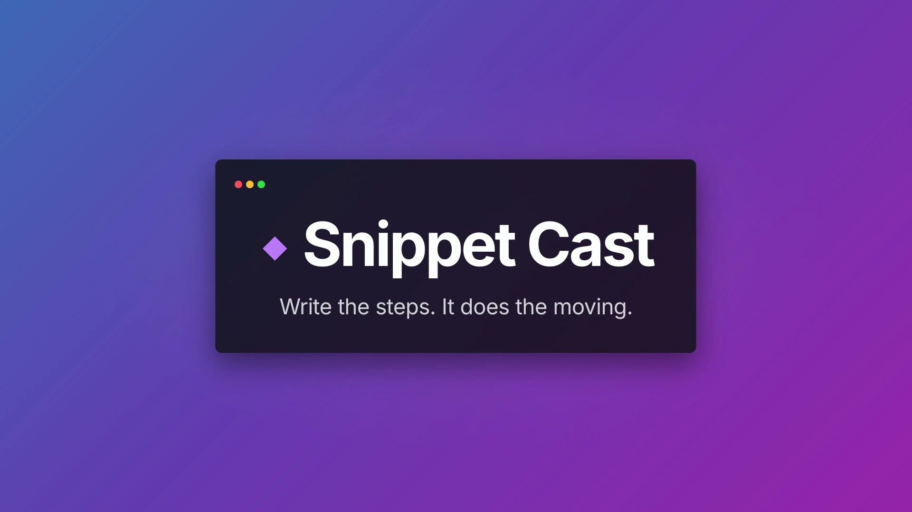

# Snippet Cast

A tool for turning code into short animated clips.
Build a timeline of code "steps"; each step is one code frame, and the app morphs
each frame into the next (token-level slide/fade) on a styled background with a window
frame. Built with Svelte 5, TypeScript, Vite, and Tailwind v4.

[](assets/video.mp4)

## How it works

- **Steps:** the numbered timeline at the bottom is the list of code frames. Step 1
  morphs into step 2 into step 3, and so on. Add (`+`), select, duplicate, delete, and
  drag to reorder.
- **Editing:** edit the current frame's code in the right sidebar; the preview updates
  instantly (no morph while typing). Navigating between steps plays the morph.
- **Animation:** the morph is [Shiki Magic Move](https://github.com/shikijs/shiki-magic-move),
  the same token-diff effect Slidev uses. `Play` runs through every frame with each
  step's hold duration.
- **Customization:** language, syntax theme, background preset, window frame, line
  numbers, font size, padding, transition speed, and per-step hold.
- **Persistence:** the project auto-saves to `localStorage`. `Export JSON` downloads
  the project; `Import` loads one back.
- **Export to video:** `Export Video` renders the morph to a real video file. Pick a
  format (MP4 / WebM / GIF), an aspect ratio (16:9, 16:10, 9:16, 1:1, 4:5), and a frame
  rate (30/60). A progress bar tracks rendering.

## How export works

The morph is driven by CSS transitions, which would normally be impossible to capture
frame-accurately. The trick: kick off each transition, grab the resulting `Animation`
objects (CSS transitions are exposed via the Web Animations API), pause them, then walk
`currentTime` in fixed fps steps. At each tick the hidden, full-resolution export stage
is rasterized with `modern-screenshot` into one frame. Frames stream into an encoder:

- **MP4**: WebCodecs `VideoEncoder` (H.264) + `mp4-muxer`
- **WebM**: WebCodecs `VideoEncoder` (VP9) + `webm-muxer`
- **GIF**: `gifenc`, capped at 15fps / 800px, with hold frames merged into one frame
  plus a longer delay to keep the file small

MP4/WebM need WebCodecs (Chrome); GIF works everywhere. The export code lives in
`src/lib/export/` (`captureFrames.ts`, `sinks.ts`, `exportVideo.ts`, `ExportStage.svelte`).

## Develop

```bash
bun install
bun run dev      # start the editor
bun run check    # svelte-check + tsc
bun run build    # production build
```
